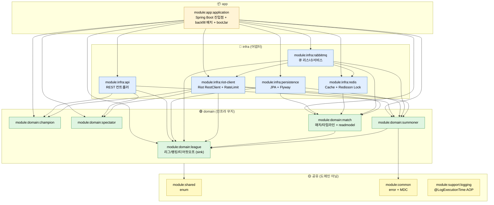

# Architecture

`lol-repository`(LoL 데이터 컨슈머 서비스)의 모듈 의존성과 데이터 흐름을 한 페이지로 정리한 문서. 변경 영향 범위 추적이 목적이며, 세부 컨벤션은 [`CLAUDE.md`](../CLAUDE.md)를 참조한다.

## 핵심 원칙

- **헥사고날 (Ports & Adapters)**: 의존은 항상 `infra → domain` 단방향. 도메인 모듈(`module:domain:*`)은 인프라 타입(`@Entity`, `RestClient`, `RedisTemplate`, AMQP)을 알지 못한다 — `ArchitectureTest`(ArchUnit)로 강제.
- **수직 바운디드 컨텍스트**: 각 도메인은 독립 gradle 모듈(`module/domain/{ctx}`)이며 `domain` + `application(port·usecase)` 를 가진다.
- **컴포지션 루트**: `module:app:application` 만 전 모듈을 알고 빈을 묶는다.
- **모듈 단일 진실원천**: `settings.gradle`.

## 모듈 의존 그래프

**읽는 법**:
- 화살표 = 컴파일 타임 의존 (`build.gradle` `implementation project(...)`).
- `infra → domain` 단방향. 도메인 모듈 사이에는 `match → league`, `summoner → league` 만 허용(league 는 sink).
- `app:application` 은 전 어댑터/도메인을 빈으로 등록하는 컴포지션 루트.

## 알려진 잔여 결합 (후속 개선 대상)

현 코드의 어댑터는 도메인 모듈에 물리적으로 co-location 되지 않고 `module:infra:*` 공유 모듈에 남아있다. 이는 다음 인프라 간 결합 때문이다(향후 분해 대상):

- `module:infra:riot-client` 의 `RiotApiService`(전 어댑터가 주입) 가 `domain.match.readmodel`(MatchDto/TimelineDto)에 결합 → 어댑터를 도메인별로 쪼개려면 `RiotApiService` 분리 선행 필요.
- `infra:persistence → infra:redis`, `infra:rabbitmq → infra:redis/riot-client` 의 인프라 간 의존.

> 어댑터의 컨텍스트별 물리 co-location(`module/domain/{ctx}/adapter/out/*`)은 위 결합 해소 후 진행한다.

## "X 가 변경되면 어디가 영향받는가?"

| 변경 대상 | 직접 영향 모듈 |
|---|---|
| `module:shared` enum 추가 | 이를 쓰는 모든 도메인/인프라 모듈 |
| 도메인 `application/port` (out port) 시그니처 | 해당 port 를 구현하는 `module:infra:*` 어댑터 |
| 도메인 `application/usecase` (in port) 시그니처 | `module:infra:api` 컨트롤러 / `rabbitmq` 리스너 |
| 도메인 객체 필드 추가 | `infra:persistence`(Entity), `infra:api`(응답), `infra:redis`(직렬화) |
| `league` 도메인 모델/포트 | `match`·`summoner` (교차 의존) + 위 인프라 |
| Flyway 마이그레이션(`lol-db-schema/`) | `infra:persistence` |
| Riot API DTO | `infra:riot-client` (도메인은 모름) |

## See Also

- [Root CLAUDE.md](../CLAUDE.md) — 모듈 표 + 코드 컨벤션
- 컨텍스트 경계 검증: `./gradlew archTest`
